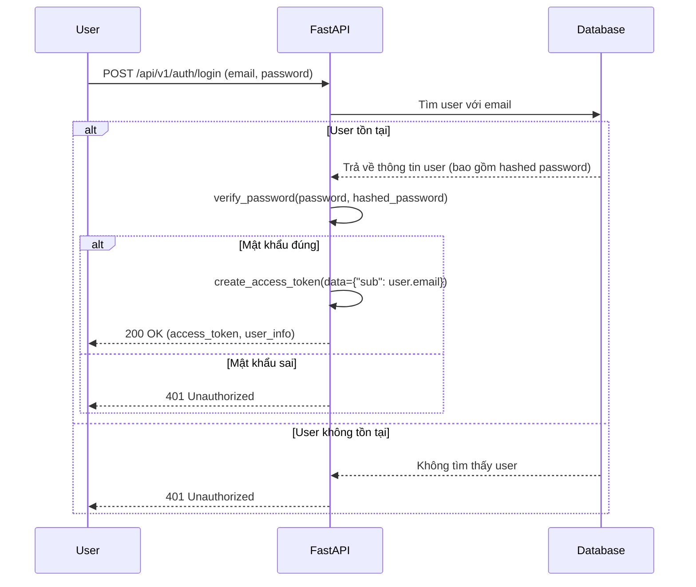

# Luồng Xác thực và Phân quyền

Tài liệu này giải thích chi tiết về cách hệ thống xử lý việc xác thực (Authentication) và phân quyền (Authorization), từ việc đăng ký, đăng nhập cho đến bảo vệ các endpoint.

## Công nghệ sử dụng

- **Hashing mật khẩu:** `Argon2` (thông qua thư viện `argon2-cffi`) để băm và xác minh mật khẩu một cách an toàn.
- **Tokens:** `JSON Web Tokens (JWT)` được sử dụng để tạo access token cho các phiên làm việc đã được xác thực.
- **OAuth2:** `OAuth2PasswordBearer` của FastAPI được dùng để trích xuất token từ header `Authorization`.

## Cơ chế hoạt động

### 1. Lưu trữ mật khẩu

Mật khẩu của người dùng không bao giờ được lưu trữ dưới dạng văn bản gốc. Thay vào đó, chúng được băm bằng thuật toán Argon2id.

- **Hashing:** Khi người dùng đăng ký, hàm `get_password_hash(password)` trong `src/core/security.py` sẽ được gọi để tạo ra một chuỗi hash an toàn.
  ```python
  # src/core/security.py
  def get_password_hash(password: str) -> str:
      """Hash a password using Argon2id."""
      return ph.hash(password)
  ```
- **Xác minh:** Khi người dùng đăng nhập, hàm `verify_password(plain_password, hashed_password)` sẽ so sánh mật khẩu người dùng nhập vào với chuỗi hash trong database.
  ```python
  # src/core/security.py
  def verify_password(plain_password: str, hashed_password: str) -> bool:
      """Verify a plain password against an Argon2 hashed password."""
      try:
          ph.verify(hashed_password, plain_password)
          return True
      except (VerifyMismatchError, InvalidHashError):
          return False
  ```

### 2. Luồng đăng nhập và tạo Token

Khi người dùng đăng nhập thành công qua endpoint `/api/v1/auth/login`, hệ thống sẽ tạo ra một JWT Access Token.



- **Tạo Token:** Hàm `create_access_token` trong `src/core/security.py` chịu trách nhiệm tạo token. Token chứa `email` của người dùng trong trường `sub` (subject) và có thời gian hết hạn được cấu hình trong file `.env`.
  ```python
  # src/core/security.py
  def create_access_token(data: dict, expires_delta: timedelta | None = None):
      # ...
      to_encode.update({"exp": expire})
      encoded_jwt = jwt.encode(to_encode, settings.SECRET_KEY, algorithm=settings.ALGORITHM)
      return encoded_jwt
  ```

### 3. Bảo vệ Endpoint và lấy thông tin người dùng

FastAPI sử dụng cơ chế `Depends` để bảo vệ các endpoint yêu cầu xác thực.

- **`get_current_user`**:
  - Đây là một dependency (trong `src/core/security.py`) dùng để xác thực token và lấy thông tin người dùng hiện tại.
  - Nó giải mã JWT token được gửi trong header `Authorization: Bearer <token>`.
  - Nếu token hợp lệ, nó truy vấn database để lấy đối tượng `User` tương ứng.
  - Nếu token không hợp lệ hoặc người dùng không tồn tại, nó sẽ trả về lỗi `401 Unauthorized`.

- **`get_verified_user`**:
  - Dependency này phụ thuộc vào `get_current_user`.
  - Sau khi lấy được người dùng, nó kiểm tra thêm trường `user.verified`.
  - Nếu `user.verified` là `False`, nó sẽ trả về lỗi `403 Forbidden` với thông báo yêu cầu xác thực email.

**Ví dụ sử dụng:**

Endpoint `/api/v1/auth/me` yêu cầu người dùng phải đăng nhập và đã xác thực email.

```python
# src/api/v1/auth.py

@router.get("/me", response_model=UserRead)
async def read_users_me(current_user: User = Depends(get_verified_user)):
    return UserRead.model_validate(current_user)
```

### 4. Luồng xác thực Email

Để đảm bảo email là thật, hệ thống yêu cầu người dùng xác thực sau khi đăng ký.

1.  **Đăng ký (`/register`)**:
    - Sau khi tạo user mới, hệ thống sẽ đẩy một job vào `Redis` để yêu cầu `Worker` gửi email xác thực.
    - Email này chứa một mã OTP (One-Time Password) và một đường link để xác thực.

2.  **Xác thực (`/verify-email`)**:
    - Người dùng nhập mã OTP nhận được từ email.
    - Endpoint này gọi `VerificationUseCase` để kiểm tra tính hợp lệ của mã.
    - Logic trong `VerificationUseCase` (sử dụng Redis) sẽ kiểm tra xem mã có đúng không, có hết hạn chưa, và giới hạn số lần thử sai.
    - Nếu mã hợp lệ, trường `verified` của user trong `PostgreSQL` sẽ được cập nhật thành `True`.

3.  **Gửi lại mã (`/resend-verification`)**:
    - Nếu người dùng không nhận được email hoặc mã hết hạn, họ có thể yêu cầu gửi lại qua endpoint này.
    - Endpoint này cũng có cơ chế rate-limiting để tránh bị spam.

